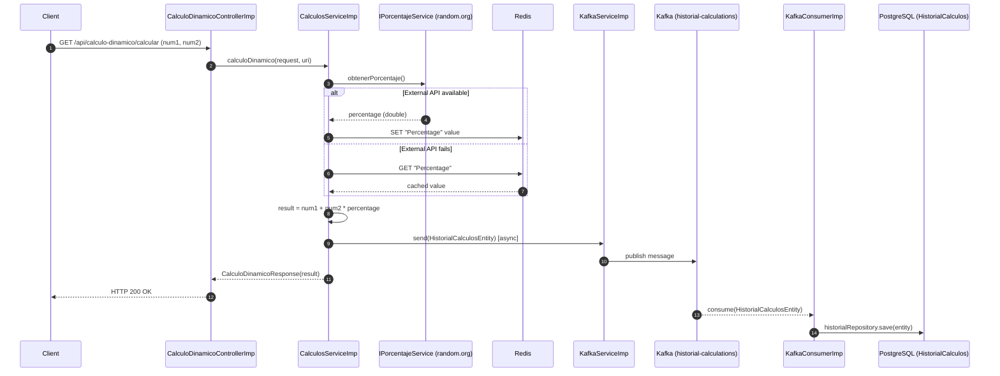

# MS-Kafka — Dynamic Calculation Microservice

[](https://openjdk.org/)
[](https://spring.io/projects/spring-boot)
[](https://kafka.apache.org/)
[](https://redis.io/)
[](https://www.postgresql.org/)
[](https://docs.docker.com/compose/)
[](https://opensource.org/licenses/MIT)

> **Repository:** [github.com/jaimeemi/MS-Kafka](https://github.com/jaimeemi/MS-Kafka)

---

## 1. Project Overview

This microservice exposes a REST API that performs a **dynamic calculation** by summing two input numbers and applying a random percentage factor fetched from an external API ([random.org](https://www.random.org)). The result is returned to the caller and the operation is **asynchronously persisted** to a PostgreSQL database via an Apache Kafka pipeline.

Core problems solved:

- **External API resilience:** The percentage value is cached in Redis for 30 minutes. If the external API is unavailable, the last known value is served from cache, preventing service degradation.
- **Non-blocking persistence:** Every calculation is published to a Kafka topic and consumed asynchronously, keeping the HTTP response latency minimal.
- **Profile-based environment isolation:** The application ships with distinct Spring profiles (`dev`, `local-kafka`, `prod`) allowing developers to run fully locally with H2 and a Kafka mock, or against real infrastructure with zero code changes.

---

## 2. Tech Stack

- **Runtime:** Java 17, Spring Boot 3.3.6
- **Web Layer:** Spring MVC (`spring-boot-starter-web`), SpringDoc OpenAPI / Swagger UI 2.3.0
- **Persistence:** Spring Data JPA (`spring-boot-starter-data-jpa`), PostgreSQL 15 (production), H2 in-memory (dev/test — `MODE=PostgreSQL`)
  - Schema is **DDL-controlled** (`ddl-auto: validate` in production); the initial schema is applied via `V1_Init_Schema.sql` mounted as a Docker init script
- **Messaging:** Apache Kafka 3.5 (Bitnami), `spring-kafka`, Zookeeper 3.8
  - Producer serializes with `JsonSerializer`; consumer uses `JsonDeserializer` with trusted package `com.main.models.entities`
- **Caching:** Redis alpine, Jedis 5.1.0, `spring-boot-starter-cache` — TTL of **30 minutes** configured via `RedisCacheManager`
- **HTTP Client:** Spring Cloud OpenFeign 4.1.1 — calls `https://www.random.org` with 5 s connect/read timeout
- **Cross-cutting:** Lombok 1.18.30, SLF4J + Logback (structured profile-aware config), `@ControllerAdvice` global exception handler
- **Testing:** JUnit 5, Mockito, `spring-kafka-test`, Testcontainers (Kafka 1.19.1)
- **Containerization:** Docker (eclipse-temurin:17-jdk-alpine base image), Docker Compose 3.8

---

## 3. Architecture / System Flow

```
┌──────────┐   GET /calcular   ┌────────────────────────┐
│  Client  │ ───────────────►  │ CalculoDinamicoController│
└──────────┘                   └──────────┬─────────────┘
                                          │ ICalculosService
                                          ▼
                               ┌──────────────────────┐
                               │  CalculosServiceImp  │
                               │  1. Fetch % from     │
                               │     Feign → random.org│
                               │  2. Cache in Redis   │
                               │  3. Compute result   │
                               │  4. Publish to Kafka │
                               └──────┬───────────────┘
                    ┌─────────────────┴──────────────────┐
                    ▼                                     ▼
          ┌──────────────────┐               ┌──────────────────────┐
          │  Redis Cache     │               │  Kafka Producer      │
          │  (TTL 30 min)    │               │  topic: historial-   │
          └──────────────────┘               │  calculations        │
                                             └──────────┬───────────┘
                                                        │ async
                                                        ▼
                                             ┌──────────────────────┐
                                             │  KafkaConsumerImp    │
                                             │  @KafkaListener      │
                                             └──────────┬───────────┘
                                                        │ JPA save
                                                        ▼
                                             ┌──────────────────────┐
                                             │  PostgreSQL          │
                                             │  HistorialCalculos   │
                                             └──────────────────────┘
```

**Sequence diagram (Mermaid):**



---

## 4. Prerequisites & Installation

**Requirements:**
- Docker ≥ 24 and Docker Compose ≥ 2
- Java 17+ and Maven 3.9+ (for local Maven runs only)

### Option A — Docker Compose (recommended)

```bash
# 1. Clone the repository
git clone https://github.com/jaimeemi/MS-Kafka.git
cd MS-Kafka

# 2. Build the JAR
./mvnw clean package -DskipTests

# 3. Start all services (PostgreSQL, Redis, Zookeeper, Kafka, App)
docker-compose up --build
```

The application starts on **port 8085**. PostgreSQL is initialized automatically from `src/main/resources/DB/V1_Init_Schema.sql`.

Default environment values used by Docker Compose:

| Variable | Default Value |
|---|---|
| `SPRING_DATASOURCE_URL` | `jdbc:postgresql://postgres:5432/historialCalculos_DB` |
| `SPRING_DATASOURCE_USERNAME` | `postgres` |
| `SPRING_DATASOURCE_PASSWORD` | `123456` |
| `SPRING_REDIS_HOST` | `redis` |
| `SPRING_KAFKA_BOOTSTRAP_SERVERS` | `kafka:9092` |
| `SPRING_PROFILES_ACTIVE` | `kafka,dev` |

To tear down:
```bash
docker-compose down -v
```

### Option B — Maven local (H2 + Kafka mock)

```bash
# No external infrastructure needed
./mvnw spring-boot:run -Dspring-boot.run.profiles=dev
```

### Option C — Maven local (H2 + real local Kafka)

```bash
./mvnw spring-boot:run -Dspring-boot.run.profiles=local-kafka
```

### Running tests

```bash
./mvnw test
```

---

## 5. Core Features & Endpoints

- **Dynamic Calculation** — Computes `num1 + num2 × percentage` where the percentage is a random decimal fetched from `random.org`. Parameters are passed as request headers.
- **Redis Cache** — The percentage is stored in Redis with a 30-minute TTL. On external API failure, the last cached value is used as a fallback.
- **Async Kafka Persistence** — Every calculation is published to the `historial-calculations` topic and consumed by `KafkaConsumerImp`, which persists the record to PostgreSQL without blocking the HTTP response.
- **Call History** — Returns all past calculations ordered by date descending.
- **Global Exception Handling** — `@ControllerAdvice` maps domain exceptions (`FeignApiException`, `RedisException`, `BaseDatosException`, etc.) to appropriate HTTP status codes.
- **Swagger UI** — Available at `http://localhost:8085/swagger-ui/index.html` when running locally.

### REST Endpoints

| Method | Path | Headers / Params | Description | Success | Error |
|---|---|---|---|---|---|
| `GET` | `/api/calculo-dinamico/calcular` | Headers: `numero1` (double), `numero2` (double) | Performs dynamic calculation and returns result | `200 OK` | `503` (Feign), `500` (calc/DB/Redis) |
| `GET` | `/api/calculo-dinamico/historial` | — | Returns all historical calculations ordered by date desc | `200 OK` | `404` (no records) |

**Example requests:**

```bash
# Dynamic calculation
curl -X GET "http://localhost:8085/api/calculo-dinamico/calcular" \
  -H "numero1: 10" \
  -H "numero2: 20"

# Call history
curl -X GET "http://localhost:8085/api/calculo-dinamico/historial"
```

**Example response — `/calcular`:**
```json
{
  "resultado": 35.7
}
```

---

## 6. DevOps & Future Enhancements

**1. CI/CD Pipeline (GitHub Actions)**
Add a `.github/workflows/ci.yml` pipeline that runs `mvn verify` (including Testcontainers-based integration tests) on every pull request, builds and pushes a Docker image to Amazon ECR on merge to `main`, and triggers a rolling deployment to ECS or EKS. This eliminates manual `docker-compose build` steps and enforces quality gates before any release.

**2. Kubernetes Helm Chart with Health Probes**
Package the service as a Helm chart with a `Deployment` that defines:
- `livenessProbe` → `GET /actuator/health/liveness` (already exposed via `management.endpoints.web.exposure.include: health`)
- `readinessProbe` → `GET /actuator/health/readiness`
- `HorizontalPodAutoscaler` scaling on CPU/memory

This enables zero-downtime rolling updates and automatic pod recovery, replacing the current single-container Docker Compose setup.

**3. Observability Stack (Prometheus + Grafana)**
Expose `micrometer-registry-prometheus` metrics via `/actuator/prometheus` and deploy a Grafana dashboard tracking:
- Kafka consumer lag on `historial-calculations`
- Redis cache hit/miss ratio for `percentageCache`
- HTTP request latency per endpoint (p95, p99)

This provides real-time visibility into the async pipeline and cache effectiveness, which are currently only observable through log inspection.
