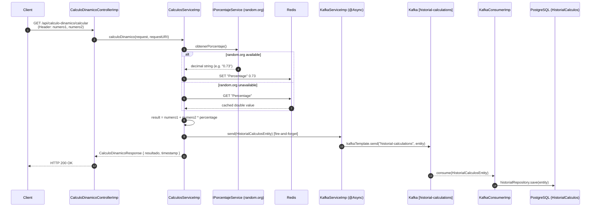

# MS-Kafka — Dynamic Calculation Microservice

[](https://openjdk.org/)
[](https://spring.io/projects/spring-boot)
[](https://kafka.apache.org/)
[](https://redis.io/)
[](https://www.postgresql.org/)
[](https://docs.docker.com/compose/)
[](https://opensource.org/licenses/MIT)

> **Repository:** [github.com/jaimeemi/MS-Kafka](https://github.com/jaimeemi/MS-Kafka)

---

## 1. Project Overview

This microservice exposes a REST API that performs a **dynamic calculation**: it sums two input numbers and multiplies the second operand by a random decimal percentage fetched from an external API ([random.org](https://www.random.org)). The formula applied is:

```
result = numero1 + (numero2 × percentage)
```

Every calculation is **asynchronously persisted** to a PostgreSQL database through an Apache Kafka pipeline, keeping HTTP response latency minimal. The service is built on **Java 17** and **Spring Boot 3.3.6**.

**Core problems solved:**

- **External API resilience** — The percentage value is cached in Redis with a 30-minute TTL. If `random.org` is unavailable, the last known value is served from cache, preventing service degradation.
- **Non-blocking persistence** — Calculation records are published to a Kafka topic and consumed asynchronously by a dedicated `@KafkaListener`, decoupling the write path from the HTTP response.
- **Profile-based environment isolation** — Three Spring profile groups (`dev`, `local-kafka`, `prod`) allow running fully locally with H2 + Kafka mock, locally with H2 + real Kafka, or in production with PostgreSQL + real Kafka — with zero code changes.

---

## 2. Tech Stack & Infrastructure

- **Runtime:** Java 17, Spring Boot 3.3.6
- **Web Layer:** Spring MVC (`spring-boot-starter-web`), SpringDoc OpenAPI / Swagger UI 2.3.0
- **Persistence:**
  - Spring Data JPA (`spring-boot-starter-data-jpa`)
  - PostgreSQL 15-alpine (production) — `ddl-auto: validate`; schema is **externally controlled** via `V1_Init_Schema.sql` mounted as a Docker init script (no Flyway/Liquibase)
  - H2 in-memory (dev/test) — `MODE=PostgreSQL` for dialect compatibility
- **Messaging:** Apache Kafka 3.5 (Bitnami image), `spring-kafka`, Zookeeper 3.8
  - Topic: `historial-calculations` — 1 partition, 1 replica, compacted
  - Producer: `JsonSerializer`; Consumer group: `call-history-group`, `JsonDeserializer` with trusted package `com.main.models.entities`
  - Dev mock: `DevKafkaConfig` registers a no-op `IKafkaService` bean when `kafka.enabled=false`
- **Caching:** Redis alpine, Jedis 5.1.0, `spring-boot-starter-cache`
  - `RedisCacheManager` with 30-minute TTL, null-value caching disabled
  - Cache eviction scheduled every 30 minutes via `@Scheduled` + `@CacheEvict`
- **HTTP Client:** Spring Cloud OpenFeign 4.1.1 — calls `https://www.random.org/decimal-fractions/` with 5 s connect/read timeout
- **Cross-cutting:** Lombok 1.18.30, SLF4J + Logback (profile-aware `logback-spring.xml`), `@ControllerAdvice` global exception handler mapping domain exceptions to HTTP status codes
- **Testing:** JUnit 5, Mockito, `spring-kafka-test`, Testcontainers Kafka 1.19.1
- **Containerization:** Dockerfile (`eclipse-temurin:17-jdk-alpine`), Docker Compose 3.8 — five services: `postgres`, `redis`, `zookeeper`, `kafka`, `app`
- **CI/CD:** No pipeline present in this repository (see Section 6 for recommendations)

---

## 3. Architecture / System Flow

The request enters through `CalculoDinamicoControllerImp`, which delegates to `CalculosServiceImp`. The service calls `IPorcentajeService` (Feign client) to fetch a random decimal from `random.org`. On success the value is stored in Redis; on failure the last cached value is retrieved. The calculation is performed in-memory and the result is returned synchronously to the caller. In parallel, `KafkaServiceImp` publishes a `HistorialCalculosEntity` to the `historial-calculations` topic using `@Async`. `KafkaConsumerImp` listens on that topic and persists the record to PostgreSQL via `ICalculosRepository`.

```
┌──────────┐  GET /calcular   ┌──────────────────────────────┐
│  Client  │ ───────────────► │ CalculoDinamicoControllerImp │
└──────────┘                  └──────────────┬───────────────┘
                                             │ ICalculosService
                                             ▼
                              ┌──────────────────────────┐
                              │    CalculosServiceImp    │
                              │  1. Feign → random.org   │
                              │  2. Redis cache (30 min) │
                              │  3. Compute result       │
                              │  4. Publish to Kafka     │
                              └────────┬─────────────────┘
               ┌────────────────────── ┴ ──────────────────────┐
               ▼                                               ▼
   ┌───────────────────┐                       ┌──────────────────────┐
   │    Redis Cache    │                       │   KafkaServiceImp    │
   │   (TTL 30 min)    │                       │  @Async producer     │
   └───────────────────┘                       └──────────┬───────────┘
                                                          │ topic: historial-calculations
                                                          ▼
                                               ┌──────────────────────┐
                                               │  KafkaConsumerImp    │
                                               │  @KafkaListener      │
                                               └──────────┬───────────┘
                                                          │ JPA save
                                                          ▼
                                               ┌──────────────────────┐
                                               │     PostgreSQL       │
                                               │  HistorialCalculos   │
                                               └──────────────────────┘
```

**Sequence diagram:**



---

## 4. Prerequisites & Installation

**Requirements:**
- Docker ≥ 24 and Docker Compose ≥ 2
- Java 17+ and Maven 3.9+ (only for local Maven runs)

### Option A — Docker Compose (recommended)

```bash
# 1. Clone the repository
git clone https://github.com/jaimeemi/MS-Kafka.git
cd MS-Kafka

# 2. Build the JAR (skip tests to speed up)
./mvnw clean package -DskipTests

# 3. Start all five services
docker-compose up --build
```

The application starts on **port 8085**. PostgreSQL is initialized automatically from `src/main/resources/DB/V1_Init_Schema.sql` (mounted as `/docker-entrypoint-initdb.d/init.sql`). The app container waits for the `postgres` healthcheck before starting.

**Default environment variables (from `docker-compose.yml`):**

| Variable | Default Value |
|---|---|
| `SPRING_PROFILES_ACTIVE` | `kafka,dev` |
| `SPRING_DATASOURCE_URL` | `jdbc:postgresql://postgres:5432/historialCalculos_DB` |
| `SPRING_DATASOURCE_USERNAME` | `postgres` |
| `SPRING_DATASOURCE_PASSWORD` | `123456` |
| `SPRING_REDIS_HOST` | `redis` |
| `SPRING_KAFKA_BOOTSTRAP_SERVERS` | `kafka:9092` |

**Exposed ports:**

| Service | Port |
|---|---|
| Application | `8085` |
| PostgreSQL | `5432` |
| Redis | `6379` |
| Kafka | `9092` |
| Zookeeper | `2181` |

To tear down and remove volumes:
```bash
docker-compose down -v
```

### Option B — Maven local (H2 + Kafka mock, no infrastructure needed)

```bash
./mvnw spring-boot:run -Dspring-boot.run.profiles=dev
```

Profile group `dev` activates `h2` + `kafka-mock`. Kafka is fully disabled (`kafka.enabled=false`); a no-op mock bean is registered by `DevKafkaConfig`. H2 runs at `jdbc:h2:mem:testdb` in `MODE=PostgreSQL`.

### Option C — Maven local (H2 + real local Kafka)

```bash
./mvnw spring-boot:run -Dspring-boot.run.profiles=local-kafka
```

Profile group `local-kafka` activates `h2` + `kafka`. Requires a Kafka broker reachable at `localhost:9092`.

### Running tests

```bash
./mvnw test
```

Integration tests use Testcontainers to spin up a real Kafka broker automatically.

---

## 5. Core Features & Endpoints

- **Dynamic Calculation** — Computes `numero1 + (numero2 × percentage)` where the percentage is a random decimal (2 decimal places) from `random.org`. Input values must be `≥ 0.1` (validated via `@DecimalMin`). Parameters are passed as **request headers**.
- **Redis Cache with Fallback** — The percentage is stored under key `"Percentage"` with a 30-minute TTL. If the external API returns `0` twice consecutively or is unreachable, the cached value is used. Cache is also evicted on a 30-minute schedule via `@Scheduled`.
- **Async Kafka Persistence** — Every calculation is published to `historial-calculations` via `KafkaServiceImp` (`@Async`). `KafkaConsumerImp` (`@KafkaListener`, group `call-history-group`) persists the `HistorialCalculosEntity` to PostgreSQL without blocking the HTTP response.
- **Call History** — Returns all past calculations ordered by `fecha DESC` via `findAllByOrderByFechaDesc()`.
- **Global Exception Handling** — `ExceptionGlobal` (`@ControllerAdvice`) maps domain exceptions to HTTP status codes:

| Exception | HTTP Status |
|---|---|
| `FeignApiException` | `503 Service Unavailable` |
| `CalculoDinamicoException` | `500 Internal Server Error` |
| `BaseDatosException` | `500 Internal Server Error` |
| `RedisException` | `500 Internal Server Error` |
| `SinHistorialCalculosException` | `404 Not Found` |
| Validation errors | `400 Bad Request` |

- **Swagger UI** — `http://localhost:8085/swagger-ui/index.html`
- **Actuator** — Health, info, and metrics endpoints exposed at `/actuator/health`, `/actuator/info`, `/actuator/metrics`

### REST Endpoints

| Method | Path | Input | Description | Success | Error |
|---|---|---|---|---|---|
| `GET` | `/api/calculo-dinamico/calcular` | Headers: `numero1` (double ≥ 0.1), `numero2` (double ≥ 0.1) | Performs dynamic calculation; publishes result to Kafka asynchronously | `200 OK` | `400` (validation), `503` (Feign), `500` (calc / Redis / DB) |
| `GET` | `/api/calculo-dinamico/historial` | — | Returns all historical calculations ordered by date descending | `200 OK` | `404` (no records found) |

**Example requests:**

```bash
# Dynamic calculation
curl -X GET "http://localhost:8085/api/calculo-dinamico/calcular" \
  -H "numero1: 10" \
  -H "numero2: 20"

# Call history
curl -X GET "http://localhost:8085/api/calculo-dinamico/historial"
```

**Example response — `GET /calcular`:**
```json
{
  "resultado": 24.6,
  "timestamp": "2024-05-15T14:30:45.123"
}
```

**Example response — `GET /historial`:**
```json
[
  {
    "id": 1,
    "fecha": "2024-05-15T14:30:45.123",
    "endpoint": "/api/calculo-dinamico/calcular",
    "parametros": "numero1=10.00&numero2=20.00",
    "respuesta": "{\"resultado\": 24.60}",
    "error": false,
    "mensajeError": null
  }
]
```

---

## 6. DevOps & CI/CD Pipeline

No CI/CD pipeline (`.github/workflows/`) is present in this repository. The following improvements are recommended:

### Improvement 1 — GitHub Actions CI/CD Pipeline

Add `.github/workflows/ci.yml` to automate the full build, test, and delivery lifecycle:

```yaml
name: CI/CD Pipeline

on:
  push:
    branches: [main]
  pull_request:
    branches: [main]

jobs:
  build-and-test:
    runs-on: ubuntu-latest
    steps:
      - uses: actions/checkout@v4
      - uses: actions/setup-java@v4
        with:
          java-version: '17'
          distribution: 'temurin'
      - run: ./mvnw verify   # runs unit + Testcontainers integration tests

  docker-push:
    needs: build-and-test
    if: github.ref == 'refs/heads/main'
    runs-on: ubuntu-latest
    steps:
      - uses: actions/checkout@v4
      - run: ./mvnw clean package -DskipTests
      - uses: aws-actions/amazon-ecr-login@v2
      - run: |
          docker build -t $ECR_REGISTRY/ms-kafka:${{ github.sha }} .
          docker push $ECR_REGISTRY/ms-kafka:${{ github.sha }}
```

This enforces quality gates on every pull request and produces a versioned Docker image on every merge to `main`, eliminating manual `docker-compose build` steps.

### Improvement 2 — Kubernetes Helm Chart with Observability

**Helm chart** — Package the service as a Helm chart with a `Deployment` defining:
- `livenessProbe` → `GET /actuator/health/liveness` (already exposed via `management.endpoints.web.exposure.include: health`)
- `readinessProbe` → `GET /actuator/health/readiness`
- `HorizontalPodAutoscaler` scaling on CPU/memory to handle calculation spikes

**Observability stack** — Add `micrometer-registry-prometheus` and expose `/actuator/prometheus`. Deploy a Grafana dashboard tracking:
- Kafka consumer lag on `historial-calculations` (detects async pipeline bottlenecks)
- Redis cache hit/miss ratio for `percentageCache` (validates the 30-minute TTL strategy)
- HTTP request latency per endpoint at p95/p99 (currently only observable through log inspection)

This replaces the single-container Docker Compose setup with a production-grade, self-healing deployment with real-time visibility into the async pipeline.
